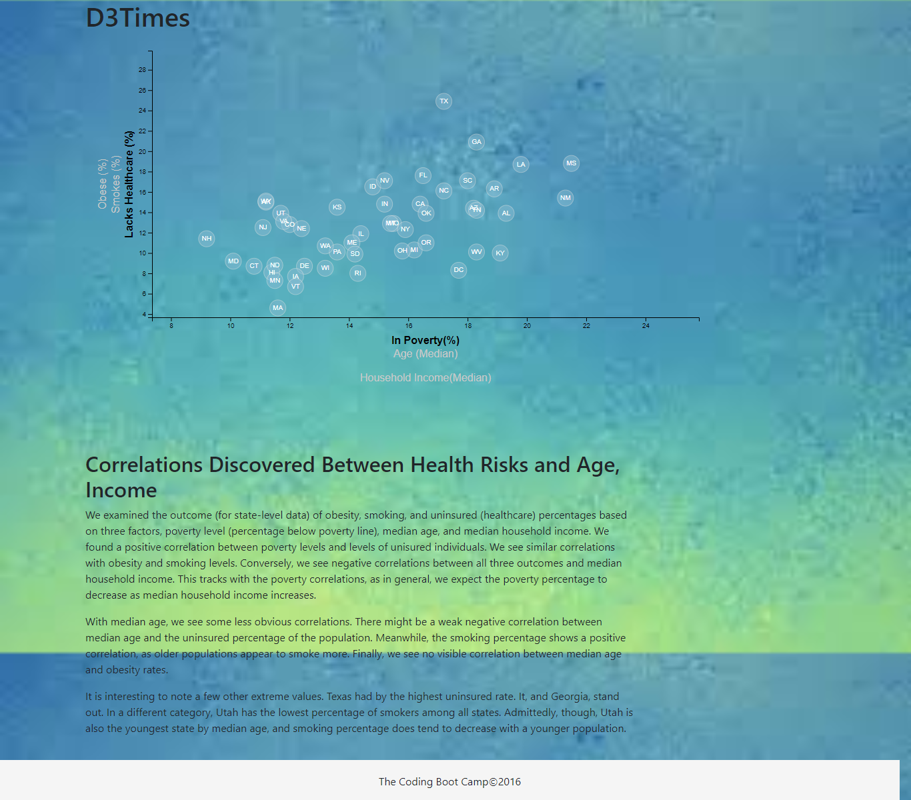

# D3-Data-Journalism

An Exploration of Public Data Visualization with D3.js

### Description
This project uses D3.js to visualize some state-level data about population health based on 2014 U.S.Three risk factors (obesity, smoking, and uninsurance rates) are plotted against three perhaps underlying factors (income, poverty rate, and age).
